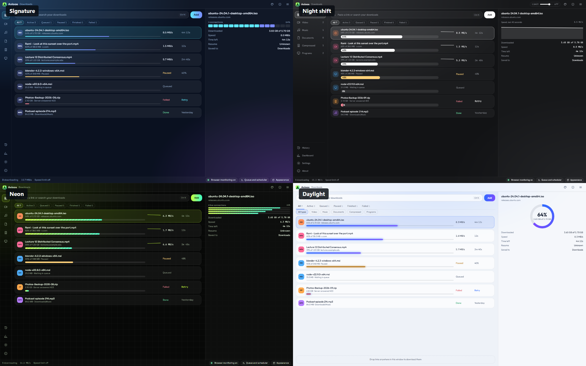
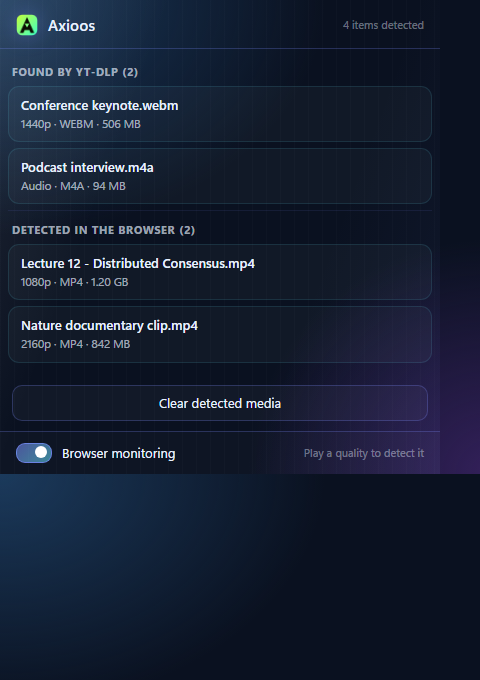
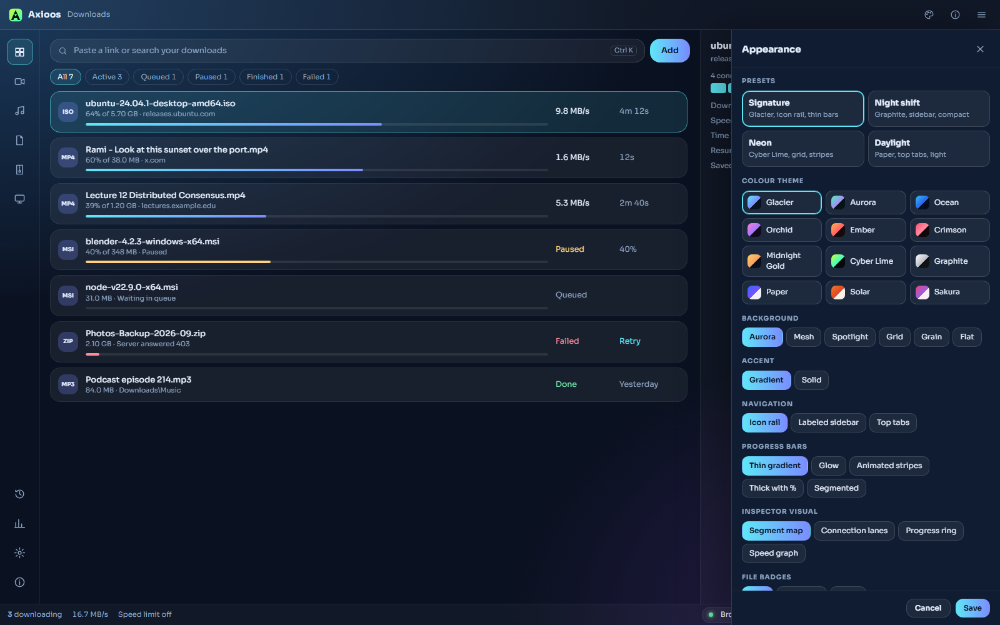
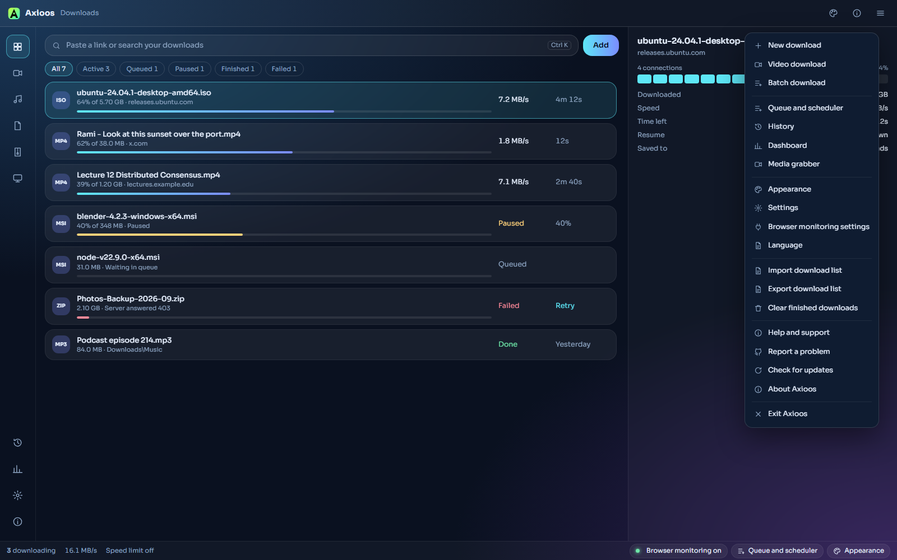

  

# Axioos Download Manager

A Windows download manager focused on reliable transfers, browser integration, media detection, recovery, and a highly customizable interface.

[Download the latest release](https://github.com/Anas-Hwaity/Axioos-Download-Manager/releases/latest) · [Privacy](PRIVACY.md) · [Security](SECURITY.md) · [Support](SUPPORT.md)

## Download

Axioos Download Manager 1.0.3 targets Windows 10 and Windows 11.

The supported installation path is the [GitHub Releases page](https://github.com/Anas-Hwaity/Axioos-Download-Manager/releases). The primary Windows setup asset is `admsetup-1.0.3.exe`.

## Four ways to make Axioos yours

The four built-in presets are **Signature**, **Night shift**, **Neon**, and **Daylight**. They change the theme, navigation, progress presentation, typography, density, backgrounds, accents, and glass level while keeping the same download workflow.

## What Axioos does

- **Resumable downloads** with validation before continuing a partial transfer.
- **Browser integration** for download takeover and media detected directly from browser activity.
- **Optional yt-dlp analysis** for sites where a deeper format analysis is useful.
- **Queues, scheduling, speed controls, history, and download rules** for organizing large download workloads.
- **Crash recovery and durable state handling** designed to avoid silently replacing damaged recovery data.
- **A live download dashboard** with progress, speed, ETA, retry state, connection information, and error history.
- **A customizable interface** with 12 colour themes, six background styles, gradient or solid accents, and adjustable glass effects.

## Browser integration

The Chromium extension can surface media detected in the browser and keep optional yt-dlp results separate, so browser-native detection remains available even when yt-dlp is not used.

Chromium-based browsers are the primary browser-integration path for Axioos 1.0. Firefox sources remain in the repository as a legacy compatibility lane and are not presented as the primary 1.0 store integration.

## Appearance

Appearance controls are live and shared across the main workspace and supporting UI surfaces. Presets can be used as-is or customized further.

## Feature surface

Downloads, video downloads, batch downloads, queues, scheduling, history, the dashboard, media tools, appearance, browser-monitoring settings, import/export, updates, and support are available from the main application surface.

## Reliability and privacy

Axioos is designed as a local desktop application. Core downloads do not require an Axioos cloud account, and the current architecture does not enable telemetry upload by default. Browser-session material used for an authenticated analysis retry is handled locally and is not intended for normal logs.

See [PRIVACY.md](PRIVACY.md) for the current privacy boundary and [SECURITY.md](SECURITY.md) for release and security invariants.

## Source, issues, and contributions

The source repository contains the Windows application, Chromium and legacy Firefox integration sources, protocol contracts, release tooling, dependency records, and architecture documentation.

- Report reproducible problems through [GitHub Issues](https://github.com/Anas-Hwaity/Axioos-Download-Manager/issues).
- Read [CONTRIBUTING.md](CONTRIBUTING.md) before preparing code changes.
- Use [SECURITY.md](SECURITY.md) for security-sensitive reports rather than posting secrets or exploit details in a public issue.

## Credits and license

Axioos Download Manager is developed by **Anas Al Hwaity**.

Axioos is a modified continuation of **Xtreme Download Manager 8.0.29** by Subhra Das Gupta. The inherited source is distributed under the **GNU General Public License, version 2**. See [LICENSE](LICENSE), [NOTICE.md](NOTICE.md), and [THIRD_PARTY_NOTICES.md](THIRD_PARTY_NOTICES.md) for the applicable notices and third-party licensing information.
